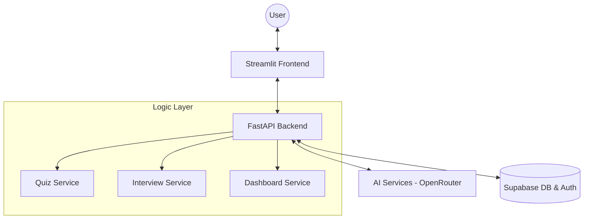

# Mentra AI: Intelligent Student Support & Interview System

**Mentra AI** is a premium SaaS-like platform designed to revolutionize the way students learn and prepare for technical careers. Using advanced Large Language Models (LLMs), Mentra AI provides personalized learning paths through adaptive quizzes and high-fidelity technical interview simulations.

---

## 🚀 Key Features

### 1. **Personalized AI Tutor (Quiz mode)**
- **Adaptive Questioning:** Generates quizzes based on specific subjects, topics, and difficulty levels.
- **Contextual Feedback:** Not only grades answers but provides deep explanations for "Why" an answer is correct or incorrect.
- **Support for Subjective Responses:** Uses AI to evaluate free-text answers with high accuracy.

### 2. **Professional Interview Simulator**
- **Role-Speficity:** Tailored logic for roles like AI Engineer, ML Engineer, Data Scientist, and more.
- **Dynamic Interaction:** Simulate real-world pressure with time-series based questioning.
- **Feedback Loop:** Get a comprehensive summary of strengths and weaknesses after every session.

### 3. **Performance Analytics Dashboard**
- **Progress Tracking:** Interactive charts visualizing score trends over time.
- **Subject Mastery:** granular breakdown of performance across different domains.
- **Data Persistence:** All attempts are stored and tracked using a secure cloud database.

### 4. **Premium User Experience**
- **Auth-First Security:** Secure login/signup system powered by Supabase.
- **Modern UI:** A clean, glassmorphic design built with custom CSS and Streamlit.
- **Fast & Responsive:** Decoupled architecture using FastAPI for the core logic layer.

---

## 🛠️ Technology Stack

| Layer | Technology |
| :--- | :--- |
| **Frontend** | Streamlit, Plotly (Visuals), Custom CSS (Glassmorphism) |
| **Backend** | Python, FastAPI |
| **Artificial Intelligence** | DeepSeek/OpenAI (via OpenRouter AI) |
| **Database & Auth** | Supabase (PostgreSQL) |
| **Environment** | Python 3.9+, Dotenv |

---

## 🏗️ System Architecture



---

## ⚙️ Setup & Installation

1. **Clone the Repository:**
   ```bash
   git clone <repository-url>
   cd "AI Tutor and Student Support System"
   ```

2. **Set up Environment Variables:**
   Create a `.env` file in the `backend/` directory:
   ```env
   OPENAI_API_KEY=your_key_here
   SUPABASE_URL=your_supabase_url
   SUPABASE_KEY=your_supabase_anon_key
   ```

3. **Install Dependencies:**
   ```bash
   pip install -r requirements.txt
   ```

4. **Run the Application:**
   - **Start Backend:** `uvicorn backend.main:app --reload`
   - **Start Frontend:** `streamlit run frontend/app.py`

---

## 👨‍💻 Developer Note
Created as part of an advanced exploration in AI-Integrated Software Engineering. Mentra AI demonstrates the synergy between modern cloud services and agentic AI to solve real-world educational challenges.